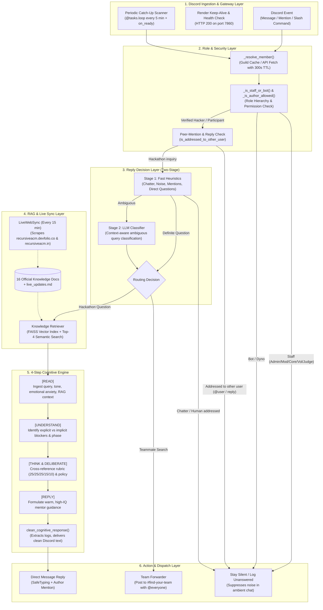
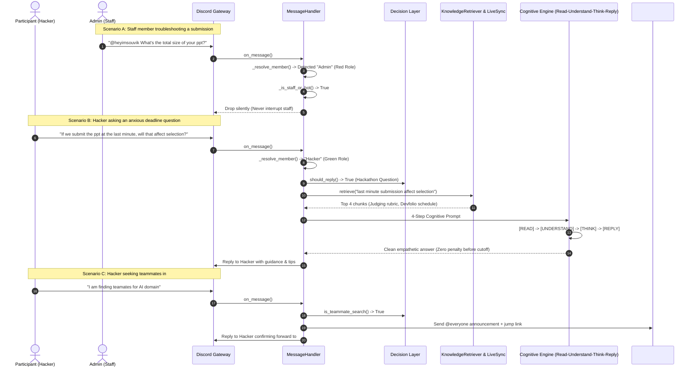

# Recursive 2026 AI Assistant (`Recur`) — Architecture & Capabilities

> **Official AI Assistant for the RECURSIVE 2026 Hackathon**  
> *Built for Guru Nanak Institute of Technology (GNIT) & ACM Student Chapter*

---

## 1. System Architecture Overview

The system is built as a multi-tier, event-driven agentic platform designed to run 24/7 on Discord with zero-lag retrieval, strict role-based access control, periodic background sync, and an empathetic 4-step cognitive reasoning engine.

---

## 2. Core Architectural Layers

### Layer 1: Discord Ingestion & Gateway Layer
- **`bot.py`**: Initializes `commands.Bot` with `intents.message_content = True`. Privileged gateway `intents.members` is intentionally set to `False` to prevent `PrivilegedIntentsRequired` gateway connection crashes when Server Members Intent is not toggled in developer portal.
- **Health Check & Keep-Alive**: Runs an internal multi-threaded HTTP server (`0.0.0.0:7860`) returning `200 OK` for continuous uptime on Render and a 9-minute self-ping loop preventing container sleep.
- **Background Scanner**: Uses `discord.ext.tasks.loop(minutes=5)` to scan `#general` and `#ask-mentors` for unanswered questions or missed teammate searches.

### Layer 2: Role, Permission & Peer Filtering Layer
- **`_resolve_member()`**: Resolves raw `discord.User` instances from history into full `discord.Member` objects via guild cache or Discord HTTP REST API (`guild.fetch_member()`), backed by a 300-second in-memory TTL cache. This bypasses the need for privileged gateway intents entirely.
- **Server Role Hierarchy Check**: Strictly isolates staff members from participants based on role colors and privileges:
  - 🔴 **Admin** (`Admin` role / Administrator permissions)
  - 🟣 **Moderator** (`Moderator` role)
  - 🔵 **Core Member** (`Core Member` role)
  - 🩷 **Volunteer** (`Volunteer` role)
  - 🟡 **Judge** (`Judge` role)
  - ⚪ **Bot / Dyno** (`Bot`, `Dyno` roles)
  - 🟢 **Hacker** (`Hacker` role — only verified participants receive ambient answers)
- **Peer-Mention & Reply Suppression**: Inspects `message.mentions`, `message.reference`, and regex patterns (`@username`). If a message is directed to another person, the bot stays silent.

### Layer 3: Two-Stage Decision Layer with Situational Awareness
- **Stage 1 (Fast Heuristics)**: Microsecond regex evaluation filtering casual chatter, emojis, greetings, human mentor requests, peer discussions, author self-resolutions ("never mind", "got it thanks"), and explicit teammate searches.
- **Stage 2 (Situational Context & LLM Classification)**: Evaluates the conversational situation in the channel:
  - **See the Situation**: Examines all subsequent messages posted after the question.
  - **Understand**: Detects if a human mentor/staff member (Admin, Moderator, Core Member, Volunteer, Judge) already answered, if someone tagged the author, or if the author acknowledged resolution.
  - **Think & Deliberate**: Decides whether answering adds genuine value or would be redundant/intrusive over a human mentor.
  - **Reply / Not Reply**: If already handled or answered by staff/peers -> **STAYS SILENT (NO REPLY)**. Only responds if the inquiry genuinely remains unaddressed.

### Layer 4: Knowledge, RAG & Live Sync Layer
- **Dense Vector Search**: FAISS index built on 16 official hackathon documents spanning rules, schedules, venue details, submission criteria, FAQs, and prize tracks.
- **`LiveWebSync` (Periodic Scraper)**: Scrapes `https://recursiveacm.devfolio.co/` and `https://recursiveacm.in` every 15 minutes, automatically updating `knowledge/live_updates.md` and triggering incremental FAISS re-indexing.

### Layer 5: 4-Step Cognitive Architecture
- **Active Production Models**:
  - **Primary Engine**: `qwen/qwen3.8-27b` (Qwen 27B on Groq LPU with ~2s sub-second inference).
  - **Automated Failover Engine**: `openai/gpt-oss-20b` (instant backup if primary encounters rate limit).
  - **Token Calibration**: `max_tokens = 700` (calibrated strictly below Groq's 1000 OTPM ceiling to prevent HTTP 429 rate limit rejections).
- **Reasoning Steps**:
  - **`[READ]`**: Ingests the query, recent conversation history, retrieved knowledge base chunks, and live Devfolio updates with attention to emotional tone.
  - **`[UNDERSTAND]`**: Identifies participant anxiety (e.g. deadline panic, submission cutoff confusion, PPT slide limits, working prototype vs idea phase).
  - **`[THINK & DELIBERATE]`**: Synthesizes official judging criteria (*Innovation 25%, Technical Complexity 25%, Working Prototype 25%, UI/UX 15%, Pitch 10%*), Devfolio submission buffers, and pragmatic mentor advice.
  - **`[REPLY]`**: Formulates an empathetic, encouraging, high-IQ Discord reply.
- **`clean_cognitive_response()` & Tone Filter**:
  - Extracts and logs internal reasoning process to server logs while serving clean presentation markdown to Discord.
  - **Greeting Moderation**: Automatically strips boilerplate `"Hi there!"` / `"Hey there! 👋"` when the participant asked a direct question without greeting, diving straight into the core answer. Greetings are only preserved if the participant explicitly greeted first.

### Layer 6: Action & Persistence Layer
- **`Database` (SQLite)**: Logs queries, latency, token usage, unanswered questions, and system metrics.
- **`ConversationMemory`**: Sliding-window context store (up to 6 turns per user/channel) supporting natural multi-turn conversations.

---

## 3. What Can Recur Do? (Capabilities Matrix)

| Category | Capability | Trigger Condition | Target Audience | Behavior & Output | Safety & Safeguards |
| :--- | :--- | :--- | :--- | :--- | :--- |
| **Q&A & Guidelines** | **Automated Hackathon Support** | Participant asks question about dates, venue, eligibility, rules, or prizes in `#general` or `#ask-mentors`. | 🟢 `Hacker` | Provides instant, grounded answers using official docs and live Devfolio timeline. | Cites official rules without leaking internal prompt or raw source tags. |
| **Cognitive Reasoning** | **Situational Anxiety De-escalation** | Participant expresses panic (e.g., last-minute PPT submission, prototype readiness, teammate dropouts). | 🟢 `Hacker` | Explains zero-penalty policy before deadline, advises 15-min Devfolio traffic buffer, and clarifies Round 1 PPT vs Round 2 Prototype requirements. | Internal `[THINK]` logs saved to server; Discord sees only clean mentor guidance. |
| **Team Recruitment** | **Teammate Request Auto-Forwarding** | Hacker posts teammate recruitment in `#general` or `#ask-mentors` (e.g. *"I am finding teamates"*). | 🟢 `Hacker` / New Member | Forwards request to `#find-your-team` with `@everyone`, quote block, and jump link. Replies to user in chat. | 60-second user cooldown prevents `@everyone` ping spam. |
| **Team Recruitment** | **In-Channel Team Search Response** | Hacker posts skill set and recruitment request inside `#find-your-team!`. | 🟢 `Hacker` / New Member | Replies in `#find-your-team!` tagging `@everyone` to maximize peer visibility. | Ignores casual greetings and non-recruitment chat in the channel. |
| **Background Loop** | **Unanswered Message Catch-Up with Situational Awareness** | A participant's question or teammate search was missed or left without reply (on bot boot or every 5 mins). | 🟢 `Hacker` | Scans recent channel history, answers genuinely unanswered queries, and forwards missed teammate searches. | **Situational Check**: Stays silent if a mentor/staff answered in subsequent messages, if someone tagged the author, if author self-resolved, or if Discord reply was used. Never talks over human mentors. |
| **Live Web Sync** | **Real-Time Deadline & Schedule Updates** | Organizer updates Devfolio schedule or website (e.g. PPT deadline extension). | Everyone | Scrapes site every 15 minutes, indexes changes into FAISS, and answers participants with live dates. | Falls back to cached data if Devfolio or website is temporarily unreachable. |
| **Admin Protection** | **Staff & Organizer Conversation Isolation** | Admin, Moderator, Core Member, Volunteer, or Judge chats or asks questions in ambient chat. | 🔴 `Admin` 🟣 `Moderator` 🔵 `Core Member` 🩷 `Volunteer` 🟡 `Judge` | **Bot stays completely silent.** Never interrupts human organizers or staff. | Verified via `_is_staff_or_bot()` and cached guild member roles. |
| **Peer Conversation** | **Peer-to-Peer Discussion Filtering** | A user tags another participant (e.g. `@heyimsouvik What's the total size of your ppt?`) or replies inline. | Anyone | **Bot stays silent.** Does not intrude into conversations between two human members. | Evaluated via `has_other_mentions`, `is_reply_to_other`, and regex pings. |
| **Direct Mention** | **Explicit Mentor Invocation** | Any user tags `@Recur` with a direct question or prompt. | Anyone | Direct override: Always answers questions when explicitly mentioned. | Rejects off-topic queries with polite hackathon focus reminder. |
| **Ambient Moderation** | **Off-Topic & Noise Suppression** | Messages containing banter, memes, greetings ("lol", "gm", "hi guys"), or non-hackathon topics. | Anyone | **Bot stays silent.** Does not spam channels with robotic refusal messages. | Strict regex patterns and ambient fallback suppression. |
| **Slash Commands** | **`/ask <query>`** | User invokes `/ask` slash command. | Anyone | Provides an instant RAG-grounded answer in any channel. | Ephemeral or channel-visible response. |
| **Slash Commands** | **`/rules`** | User invokes `/rules` slash command. | Anyone | Displays formatted embed with team limits (2–4), 8-slide PPT rule, and judging criteria. | Pre-compiled verified rule summary. |
| **Slash Commands** | **`/schedule`** | User invokes `/schedule` slash command. | Anyone | Displays key dates (Round 1 cutoff, Hackathon day 8 Oct 2026 at GNIT). | Synced with live Devfolio dates. |
| **Slash Commands** | **`/sync`** | Organizer invokes `/sync` slash command. | 🔴 `Admin` 🔵 `Core Member` | Forces an immediate on-demand live scrape of Devfolio and website and rebuilds FAISS index. | Restricted to authorized administrators. |
| **Slash Commands** | **`/stats`** | Organizer invokes `/stats` slash command. | 🔴 `Admin` 🔵 `Core Member` | Displays operational metrics: total queries, cache hit rates, average latency, and unanswered questions. | Restricted to authorized administrators. |

---

## 4. Role Hierarchy & Interaction Matrix

| Discord Role | Role Color | Member Count | Role Category | Ambient Q&A | Teammate Forward | Catch-Up Scan | Direct `@Recur` |
| :--- | :---: | :---: | :--- | :---: | :---: | :---: | :---: |
| **`Admin`** | 🔴 Red | 5 | Server Administrator / Core Lead | ❌ Silent | ❌ Ignored | ❌ Ignored | ❌ Excluded |
| **`Moderator`** | 🟣 Purple | 3 | Community Moderator | ❌ Silent | ❌ Ignored | ❌ Ignored | ❌ Excluded |
| **`Core Member`** | 🔵 Blue | 13 | Hackathon Organizer | ❌ Silent | ❌ Ignored | ❌ Ignored | ❌ Excluded |
| **`Volunteer`** | 🩷 Pink | 11 | Hackathon Student Volunteer | ❌ Silent | ❌ Ignored | ❌ Ignored | ❌ Excluded |
| **`Judge`** | 🟡 Yellow | 0 | Hackathon Project Evaluator | ❌ Silent | ❌ Ignored | ❌ Ignored | ❌ Excluded |
| **`Bot` / `Dyno`** | ⚪ Grey | 3 | Automated Bots | ❌ Silent | ❌ Ignored | ❌ Ignored | ❌ Ignored |
| **`Hacker`** | 🟢 Green | 88 | **Verified Participant** | ✅ **Answers** | ✅ **Forwards** | ✅ **Scans** | ✅ **Answers** |
| **`@everyone` (New)**| Default | 122 | Newly Joined Unassigned User | ❌ Silent | ✅ **Forwards** | ✅ **Forwards** | ✅ **Answers** |

---

## 5. Channel Routing Matrix

| Channel | Allowed Actions | Disallowed Actions | Notification Rules |
| :--- | :--- | :--- | :--- |
| **`#general`** | Ambient hackathon Q&A, teammate search detection & forwarding, direct `@Recur` pings. | Staff conversation interruptions, peer-to-peer mention answers, off-topic chat. | Mentions author on reply; forwards team requests to `#find-your-team`. |
| **`#ask-mentors` / `#ask-mentor`** | Official rules, judging criteria, technical stack questions, teammate search forwarding. | Intercepting questions explicitly addressed to human mentors (`"Mentors, please check..."`). | Silent fallback: Logs unanswered technical queries for human organizers. |
| **`#find-your-team!`** | Teammate recruitment announcements, skill offers, team formation. | General chatter, unrelated queries. | Pings `@everyone` with a 60-second author cooldown. |
| **Restricted Channels** *(#announcements, #rules, etc.)* | None (unless bot is directly `@Recur` mentioned). | Auto-replies, ambient chatter answers. | Completely silent. |
| **Direct Messages (DMs)** | Full conversational Q&A and hackathon guidance. | Server-wide broadcasts. | One-on-one assistance. |

---

## 6. End-to-End Interaction Flow

