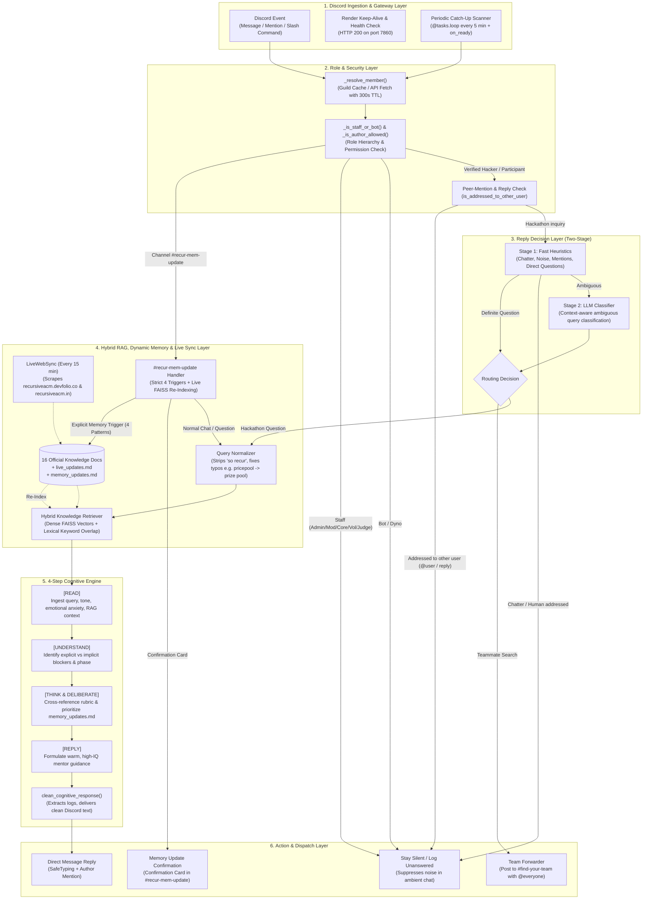
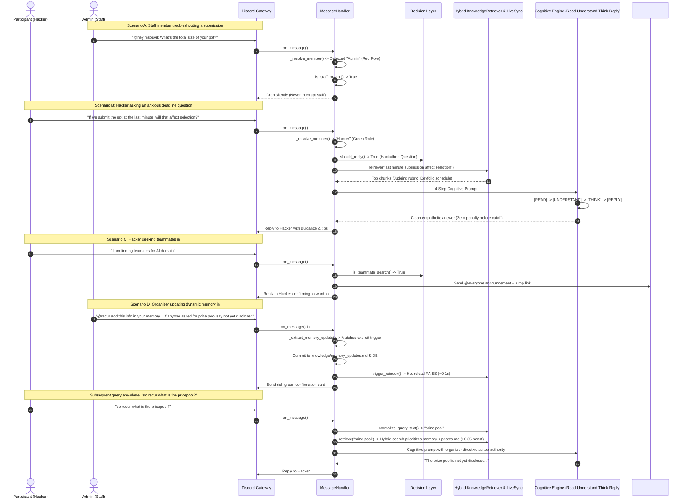

# Recursive 2026 AI Assistant (`Recur`) — Architecture & Capabilities

> **Official AI Assistant for the RECURSIVE 2026 Hackathon**  
> *Built for Guru Nanak Institute of Technology (GNIT) & ACM Student Chapter*

---

## 1. System Architecture Overview

The system is built as a multi-tier, event-driven agentic platform designed to run **24/7 on Discord** with zero-lag retrieval, strict role-based access control, periodic background sync, and an empathetic 4-step cognitive reasoning engine.



---

## 2. Core Architectural Layers

### Layer 1: Discord Ingestion & Gateway Layer
- **`bot.py`**: Initializes `commands.Bot` with `intents.message_content = True`. Privileged gateway `intents.members` is intentionally set to `False` to prevent `PrivilegedIntentsRequired` gateway connection crashes when Server Members Intent is not toggled in developer portal.
- **Health Check & Keep-Alive**: Runs an internal multi-threaded HTTP server (`0.0.0.0:7860`) returning `200 OK` for continuous uptime on Render/Hugging Face Spaces and a 9-minute self-ping loop preventing container sleep/idle on free tiers.
- **Background Scanner**: Uses `discord.ext.tasks.loop(minutes=5)` to scan `#general`, `#ask-mentors`, and `#recur-mem-update` for unanswered questions or missed teammate searches.
- **Auto-Reconnection Loop**: Discord connection wrapped in infinite retry loop with exponential backoff (5s → 60s max) handling `GatewayNotFound`, `ConnectionClosed`, and `LoginFailure`.

### Layer 2: Role, Permission & Peer Filtering Layer
- **`_resolve_member()`**: Resolves raw `discord.User` instances from history into full `discord.Member` objects via guild cache or Discord HTTP REST API (`guild.fetch_member()`), backed by a 300-second in-memory TTL cache. This bypasses the need for privileged gateway intents entirely.
- **Server Role Hierarchy Check**: Strictly isolates staff members from participants based on role colors and privileges:
  - 🔴 **Admin** (`Admin` role / Administrator permissions)
  - 🟣 **Moderator** (`Moderator` role)
  - 🔵 **Core Member** (`Core Member` role)
  - 🩷 **Volunteer** (`Volunteer` role)
  - 🟡 **Judge** (`Judge` role)
  - ⚪ **Bot / Dyno** (`Bot`, `Dyno` roles)
  - 🟢 **Hacker** (`Hacker` role — only verified participants receive ambient answers)
  - *Exception*: In **`#recur-mem-update`**, all staff restrictions are automatically bypassed.
- **Peer-Mention & Reply Suppression**: Inspects `message.mentions`, `message.reference`, and regex patterns (`@username`). If a message is directed to another person, the bot stays silent.

### Layer 3: Two-Stage Decision Layer with Situational Awareness
- **Stage 1 (Fast Heuristics)**: Microsecond regex evaluation filtering casual chatter, emojis, greetings, human mentor requests, peer discussions, author self-resolutions ("never mind", "got it thanks"), and explicit teammate searches.
- **Stage 2 (Situational Context & LLM Classification)**: Evaluates the conversational situation in the channel:
  - **See the Situation**: Examines all subsequent messages posted after the question.
  - **Understand**: Detects if a human mentor/staff member (Admin, Moderator, Core Member, Volunteer, Judge) already answered, if someone tagged the author, or if the author acknowledged resolution.
  - **Think & Deliberate**: Decides whether answering adds genuine value or would be redundant/intrusive over a human mentor.
  - **Reply / Not Reply**: If already handled or answered by staff/peers -> **STAYS SILENT (NO REPLY)**. Only responds if the inquiry genuinely remains unaddressed.

### Layer 4: Hybrid RAG, Dynamic Memory & Live Sync Layer
- **Query Normalization Engine (`normalize_query_text`)**:
  - Strips leading conversational bot addresses (`so recur `, `hey recur `, `recur `).
  - Normalizes common phonetic typos and compound words (e.g. `pricepool` $\rightarrow$ `prize pool`, `prices` $\rightarrow$ `prizes`, `teamates` $\rightarrow$ `teammates`, `submition` $\rightarrow$ `submission`).
- **Hybrid Retrieval Architecture (Dense Vector + Lexical Overlap)**:
  - **Dense Vector Search**: FAISS index built on 16 official hackathon documents spanning rules, schedules, venue details, submission criteria, FAQs, and prize tracks.
  - **Lexical Keyword Overlap**: Content keyword matching with English stop-word filtering prevents generic documents (like `chair.md`) from dominating short queries.
  - **Dynamic Organizer Memory Priority**: All entries in `knowledge/memory_updates.md` are evaluated across a 25-candidate window and given an organizer priority boost (`+0.35`) when query keywords match live organizer directives.
- **`LiveWebSync` (Continuous Polling & Daily Maintenance)**:
  - **15-Minute Continuous Polling**: Runs every 15 minutes (900s) as a daemon thread, scraping `https://recursiveacm.devfolio.co/` (API + schedule page) and `https://recursiveacm.in`.
  - **Data-Payload Hashing**: Compares raw extracted JSON/data hash (excluding dynamic clock timestamps) so FAISS re-indexing only triggers when actual deadlines, announcements, or status change.
  - **Daily 24-Hour Maintenance Checkpoint**: A dedicated Discord `@tasks.loop(hours=24)` (`daily_memory_sync`) runs an audit sync, forces full freshness verification, and logs results to SQLite `system_metrics` (`daily_sync_status`).
  - **Rate Limiting**: Enforces minimum 60s cooldown between web requests unless forced via `/sync` command or daily maintenance.
- **Dynamic Memory Ingestion & Removal (`#recur-mem-update`)**:
  - **Memory Ingestion Triggers** (4 patterns):
    1. `@recur add this info in your memory .. <info>`
    2. `add to memory: <info>`
    3. `auto update memory: <info>`
    4. `remember this: <info>`
  - **Memory Removal Triggers** (7 patterns):
    1. `@recur remove this info from your memory .. <target>`
    2. `@recur remove from memory: <target>`
    3. `remove from memory: <target>`
    4. `remove from mem: <target>`
    5. `remove mem: <target>`
    6. `delete from memory: <target>`
    7. `forget this: <target>`
  - Automatically writes or purges entries from `memory_updates.md`, updates the SQLite database, rebuilds FAISS vectors in `< 0.1s`, and hot-reloads the retriever with zero downtime.
  - All other messages are handled as normal conversation.

### Layer 5: 4-Step Cognitive Architecture
- **Active Production Models**:
  - **Primary Engine**: `qwen/qwen3.8-27b` (Qwen 27B on Groq LPU with ~2s sub-second inference).
  - **Automated Failover Engine**: `openai/gpt-oss-20b` (instant backup if primary encounters rate limit).
  - **Token Calibration**: `max_tokens = 900` (expanded ceiling allowing complete, un-truncated markdown responses while preserving concise internal cognitive thoughts).
- **Reasoning Steps**:
  - **`[READ]`**: Ingests the query, recent conversation history, retrieved knowledge base chunks, and live Devfolio updates with attention to emotional tone.
  - **`[UNDERSTAND]`**: Identifies participant anxiety (e.g. deadline panic, submission cutoff confusion, PPT slide limits, working prototype vs idea phase, Devfolio team formation).
  - **`[THINK & DELIBERATE]`**: Synthesizes official judging criteria (*Innovation 25%, Technical Complexity 25%, Working Prototype 25%, UI/UX 15%, Pitch 10%*), Devfolio submission buffers, and pragmatic mentor advice in `< 40 words`.
  - **`[REPLY]`**: Formulates an empathetic, encouraging, high-IQ Discord reply.
- **`clean_cognitive_response()` & Tone Filter**:
  - Extracts and logs internal reasoning process to server logs while serving clean presentation markdown to Discord.
  - **Greeting Moderation**: Automatically strips boilerplate `"Hi there!"` / `"Hey there! 👋"` when the participant asked a direct question without greeting, diving straight into the core answer. Greetings are only preserved if the participant explicitly greeted first.

### Layer 6: Action & Persistence Layer
- **`Database` (SQLite with WAL mode & Thread Safety)**: Logs queries, latency, token usage, unanswered questions, and system metrics. Configured with `PRAGMA journal_mode = WAL`, `PRAGMA synchronous = NORMAL`, `PRAGMA busy_timeout = 30000`, `timeout = 30.0s`, and `threading.RLock()` serialization across all write transactions.
- **`ConversationMemory`**: Sliding-window context store (up to 6 turns per user/channel) supporting natural multi-turn conversations.

---

## 3. 24/7 Operation & Heavy Demand Resilience

### Deployment Strategies (All Production-Ready)
| Platform | Configuration | Auto-Restart | Health Check |
|----------|--------------|--------------|--------------|
| **Docker / Docker Compose** | `docker-compose.yml` with `restart: unless-stopped` | ✅ Container-level | HTTP 200 on :7860 |
| **systemd (Linux VM)** | `deploy/hackbot.service` with `Restart=always`, `RestartSec=10` | ✅ Service-level | HTTP 200 on :7860 |
| **Render (Free Tier)** | `render.yaml` web service, auto-deploys from Git | ✅ Platform-level | HTTP 200 on :7860 + 9-min self-ping |
| **Hugging Face Spaces** | `Dockerfile` with `EXPOSE 7860` | ✅ Platform-level | HTTP 200 on :7860 |

### Concurrency & Heavy Demand Handling
- **SQLite WAL Mode & Thread Locks**: `journal_mode=WAL` allows concurrent readers + single writer without locking bottlenecks. `busy_timeout=30000` + reentrant `self._lock` serialization prevents "database is locked" errors during simultaneous database write bursts.
- **LLM Concurrency Queueing (`asyncio.Semaphore(8)`)**: Under heavy message surges (e.g. 50+ participants messaging simultaneously), the bot queues LLM generation calls to a max of 8 parallel requests, preventing API rate-limit spikes while servicing all users sequentially in seconds.
- **Groq 429 Exponential Backoff**: Automatic retry loop with a 1.5s backoff if Groq returns HTTP 429 or transient 503; smooth fallback to grounded context extraction if all attempts fail so no query is ever lost.
- **Per-User Burst Anti-Spam Throttle**: 1.5-second query throttle per user prevents raid/burst attacks from overwhelming Discord channels or consuming API quotas.
- **24/7 Memory Leak Prevention**: Background in-memory caches (`_user_last_query`, `_member_cache`, `last_team_ping`) are automatically pruned every 5 minutes, maintaining flat memory usage indefinitely.
- **Discord Gateway Resilience**: 
  - `reconnect=True` in `bot.run()` enables automatic WebSocket reconnection.
  - Application-level exponential backoff (5s → 10s → 20s → 40s → 60s cap) for `GatewayNotFound`, `ConnectionClosed`, and generic exceptions.
  - `on_disconnect` / `on_resumed` logging for observability.
- **Background Tasks & Daemons**:
  - LiveWebSync Daemon (15 min interval, 30s startup delay)
  - Daily Memory Sync (`@tasks.loop(hours=24)` maintenance checkpoint)
  - Keep-Alive Ping (9 min interval, 3 min startup delay)
  - Health Check HTTP Server (non-blocking `serve_forever` on port 7860)
  - Discord Periodic Catch-Up Task (5 min interval via `discord.ext.tasks`)

### Memory & Knowledge Persistence
- **FAISS Index**: Persisted to `data/faiss.index` + `data/metadata.json` — survives container restarts.
- **SQLite Database**: `data/hackbot.db` with WAL — survives restarts, tracks all queries, unanswered questions, conversation history, and dynamic memory updates.
- **Knowledge Files**: 16 static `.md` files in `knowledge/` + `live_updates.md` (auto-updated every 15 min & daily) + `memory_updates.md` (organizer-controlled) — all version-controlled in Git.

---

## 4. What Can Recur Do? (Capabilities Matrix)

| Category | Capability | Trigger Condition | Target Audience | Behavior & Output | Safety & Safeguards |
| :--- | :--- | :--- | :--- | :--- | :--- |
| **Q&A & Guidelines** | **Automated Hackathon Support** | Participant asks question about dates, venue, eligibility, rules, or prizes in `#general` or `#ask-mentors`. | 🟢 `Hacker` | Provides instant, grounded answers using official docs and live Devfolio timeline via Hybrid RAG. | Cites official rules without leaking internal prompt or raw source tags. |
| **Cognitive Reasoning** | **Situational Anxiety De-escalation** | Participant expresses panic (e.g., last-minute PPT submission, prototype readiness, teammate dropouts). | 🟢 `Hacker` | Explains zero-penalty policy before deadline, advises 15-min Devfolio traffic buffer, and clarifies Round 1 PPT vs Round 2 Prototype requirements. | Internal `[THINK]` logs saved to server; Discord sees only clean mentor guidance. |
| **Team Recruitment** | **Teammate Request Auto-Forwarding** | Hacker posts teammate recruitment in `#general` or `#ask-mentors` (e.g. *"I am finding teamates"*). | 🟢 `Hacker` / New Member | Forwards request to `#find-your-team` with `@everyone`, quote block, and jump link. Replies to user in chat. | 60-second user cooldown prevents `@everyone` ping spam. |
| **Team Recruitment** | **In-Channel Team Search Response** | Hacker posts skill set and recruitment request inside `#find-your-team!`. | 🟢 `Hacker` / New Member | Replies in `#find-your-team!` tagging `@everyone` to maximize peer visibility. | Ignores casual greetings and non-recruitment chat in the channel. |
| **Background Loop** | **Unanswered Message Catch-Up with Situational Awareness** | A participant's question or teammate search was missed or left without reply (on bot boot or every 5 mins). | 🟢 `Hacker` | Scans recent channel history, answers genuinely unanswered queries, and forwards missed teammate searches. | **Situational Check**: Stays silent if a mentor/staff answered in subsequent messages, if someone tagged the author, if author self-resolved, or if Discord reply was used. Never talks over human mentors. |
| **Live Web Sync** | **Real-Time Deadline & Schedule Updates** | Organizer updates Devfolio schedule or website (e.g. PPT deadline extension). | Everyone | Scrapes site every 15 minutes, indexes changes into FAISS, and answers participants with live dates. | Falls back to cached data if Devfolio or website is temporarily unreachable. |
| **Dynamic Memory** | **Live Organizer Memory Ingestion & Removal** | Organizer posts dynamic addition or removal trigger in `#recur-mem-update`:<br>• **Add**: `@recur add this info in your memory ..`, `add to memory:`, `auto update memory:`, `remember this:`<br>• **Remove**: `@recur remove from memory:`, `remove from mem:`, `remove mem:`, `delete from memory:`, `forget this:`<br>*(All other messages are treated as normal chat)*. | Anyone in `#recur-mem-update` (including 🔴 `Admin`, 🔵 `Core Member`, 🩷 `Volunteer`) | **Auto Updates / Removes Memory**: Appends or purges notes in `knowledge/memory_updates.md`, updates SQLite, rebuilds FAISS vectors in `< 0.1s`, hot-reloads retriever, and confirms via rich card. Directives receive authoritative priority (`+0.35` boost) across all channels. | Strict prefix validation prevents casual banter or greetings from polluting knowledge base. Hot-reload has zero downtime. |
| **Admin Protection** | **Staff & Organizer Conversation Isolation** | Admin, Moderator, Core Member, Volunteer, or Judge chats or asks questions in ambient chat. | 🔴 `Admin`<br>🟣 `Moderator`<br>🔵 `Core Member`<br>🩷 `Volunteer`<br>🟡 `Judge` | **Bot stays completely silent in standard channels.** Never interrupts human organizers or staff (bypassed only in `#recur-mem-update`). | Verified via `_is_staff_or_bot()` and cached guild member roles. |
| **Peer Conversation** | **Peer-to-Peer Discussion Filtering** | A user tags another participant (e.g. `@heyimsouvik What's the total size of your ppt?`) or replies inline. | Anyone | **Bot stays silent.** Does not intrude into conversations between two human members. | Evaluated via `has_other_mentions`, `is_reply_to_other`, and regex pings. |
| **Direct Mention** | **Explicit Mentor Invocation** | Any user tags `@Recur` with a direct question or prompt. | Anyone | Direct override: Always answers questions when explicitly mentioned. | Rejects off-topic queries with polite hackathon focus reminder. |
| **Ambient Moderation** | **Off-Topic & Noise Suppression** | Messages containing banter, memes, greetings ("lol", "gm", "hi guys"), or non-hackathon topics. | Anyone | **Bot stays silent.** Does not spam channels with robotic refusal messages. | Strict regex patterns and ambient fallback suppression. |
| **Slash Commands** | **`/ask <query>`** | User invokes `/ask` slash command. | Anyone | Provides an instant RAG-grounded answer in any channel. | Ephemeral or channel-visible response. |
| **Slash Commands** | **`/rules`** | User invokes `/rules` slash command. | Anyone | Displays formatted embed with team limits (2–4), 8-slide PPT rule, and judging criteria. | Pre-compiled verified rule summary. |
| **Slash Commands** | **`/schedule`** | User invokes `/schedule` slash command. | Anyone | Displays key dates (Round 1 cutoff, Hackathon day 8 Oct 2026 at GNIT). | Synced with live Devfolio dates. |
| **Slash Commands** | **`/sync`** | Organizer invokes `/sync` slash command. | 🔴 `Admin`<br>🔵 `Core Member` | Forces an immediate on-demand live scrape of Devfolio and website and rebuilds FAISS index. | Restricted to authorized administrators. |
| **Slash Commands** | **`/stats`** | Organizer invokes `/stats` slash command. | 🔴 `Admin`<br>🔵 `Core Member` | Displays operational metrics: total queries, cache hit rates, average latency, and unanswered questions. | Restricted to authorized administrators. |

---

## 5. Role Hierarchy & Interaction Matrix

> [!NOTE]
> In `#recur-mem-update`, all staff restrictions are automatically bypassed so organizers and volunteers can dynamically inject memory and test knowledge. The table below represents ambient chat behavior across `#general` and `#ask-mentors`.

| Discord Role | Role Color | Member Count | Role Category | Ambient Q&A | Teammate Forward | Catch-Up Scan | Direct `@Recur` | `#recur-mem-update` |
| :--- | :---: | :---: | :--- | :---: | :---: | :---: | :---: | :---: |
| **`Admin`** | 🔴 Red | 5 | Server Administrator / Core Lead | ❌ Silent | ❌ Ignored | ❌ Ignored | ❌ Excluded | ✅ **Full Access** |
| **`Moderator`** | 🟣 Purple | 3 | Community Moderator | ❌ Silent | ❌ Ignored | ❌ Ignored | ❌ Excluded | ✅ **Full Access** |
| **`Core Member`** | 🔵 Blue | 13 | Hackathon Organizer | ❌ Silent | ❌ Ignored | ❌ Ignored | ❌ Excluded | ✅ **Full Access** |
| **`Volunteer`** | 🩷 Pink | 11 | Hackathon Student Volunteer | ❌ Silent | ❌ Ignored | ❌ Ignored | ❌ Excluded | ✅ **Full Access** |
| **`Judge`** | 🟡 Yellow | 0 | Hackathon Project Evaluator | ❌ Silent | ❌ Ignored | ❌ Ignored | ❌ Excluded | ✅ **Full Access** |
| **`Bot` / `Dyno`** | ⚪ Grey | 3 | Automated Bots | ❌ Silent | ❌ Ignored | ❌ Ignored | ❌ Ignored | ❌ Ignored |
| **`Hacker`** | 🟢 Green | 88 | **Verified Participant** | ✅ **Answers** | ✅ **Forwards** | ✅ **Scans** | ✅ **Answers** | ✅ **Full Access** |
| **`@everyone` (New)**| Default | 122 | Newly Joined Unassigned User | ❌ Silent | ✅ **Forwards** | ✅ **Forwards** | ✅ **Answers** | ✅ **Full Access** |

---

## 6. Channel Routing Matrix

| Channel | Allowed Actions | Disallowed Actions | Notification Rules |
| :--- | :--- | :--- | :--- |
| **`#recur-mem-update`** *(aliases: `mem-update`, `recur-memory`)* | 1. Dynamic memory updates (Add triggers: `@recur add this info in your memory ..`, `add to memory:`, `auto update memory:`, `remember this:` / Remove triggers: `remove from mem:`, `remove mem:`, `delete from memory:`, `forget this:`).<br>2. Live zero-downtime FAISS re-indexing.<br>3. Normal chat & interactive Q&A testing for organizers. | None (Staff silence restriction is completely disabled here). | Rich Discord confirmation card with re-indexing status and summary for memory updates; standard conversational reply for normal chat. |
| **`#general`** | Ambient hackathon Q&A, teammate search detection & forwarding, direct `@Recur` pings. | Staff conversation interruptions, peer-to-peer mention answers, off-topic chat. | Mentions author on reply; forwards team requests to `#find-your-team`. |
| **`#ask-mentors` / `#ask-mentor`** | Official rules, judging criteria, technical stack questions, teammate search forwarding. | Intercepting questions explicitly addressed to human mentors (`"Mentors, please check..."`). | Silent fallback: Logs unanswered technical queries for human organizers. |
| **`#find-your-team!`** | Teammate recruitment announcements, skill offers, team formation. | General chatter, unrelated queries. | Pings `@everyone` with a 60-second author cooldown. |
| **Restricted Channels** *(#announcements, #rules, etc.)* | None (unless bot is directly `@Recur` mentioned). | Auto-replies, ambient chatter answers. | Completely silent. |
| **Direct Messages (DMs)** | Full conversational Q&A and hackathon guidance. | Server-wide broadcasts. | One-on-one assistance. |

---

## 7. End-to-End Interaction Flow



---

## 8. Configuration & Environment Variables

All configuration is centralized in `config.py` with `.env` overrides. Key variables:

| Variable | Default | Description |
| :--- | :--- | :--- |
| `DISCORD_TOKEN` | *(required)* | Bot token from Discord Developer Portal |
| `LLM_PROVIDER` | `gemini` | `groq` or `gemini` (auto-detected from API keys) |
| `GROQ_API_KEY` | — | Groq API key for primary LLM (`qwen/qwen3.8-27b`) |
| `GEMINI_API_KEY` | — | Google Gemini API key for fallback/primary |
| `LLM_MODEL` | provider-specific | Override model (e.g. `qwen/qwen3.8-27b`, `gemini-2.5-flash`) |
| `EMBEDDING_MODEL` | `text-embedding-004` | Embedding model for FAISS indexing |
| `ALLOWED_CHANNELS` | `general,ask-mentors,...` | Comma-separated channel names for ambient replies |
| `ALLOWED_ROLES` | `hacker,hackers,participant,...` | Roles permitted to receive ambient answers |
| `EXCLUDED_ROLES` | `admin,moderator,core member,...` | Roles that bot ignores in ambient chat |
| `TEAM_FINDING_CHANNELS` | `find-your-team,find-your-team!` | Channels where teammate search gets `@everyone` |
| `MEMORY_CHANNEL_NAMES` | `recur-mem-update,recur-memory,...` | Channels where dynamic memory updates work |
| `MODERATOR_MODE` | `true` | Enable staff silence & situational awareness |
| `PORT` | `7860` | Health check HTTP server port (Render/HF Spaces) |
| `RENDER_EXTERNAL_URL` | — | Auto-set by Render; enables keep-alive self-ping |

---

## 9. Directory Structure

```
Recur/
├── ai/                     # LLM providers, embeddings, classifier, generator
│   ├── __init__.py
│   ├── classifier.py       # Two-stage decision (heuristics + LLM)
│   ├── embeddings.py       # Embedding provider factory (Gemini)
│   ├── generator.py        # 4-step cognitive answer generator
│   └── provider.py         # LLM provider factory (Groq/Gemini)
├── config.py               # Centralized configuration (dataclass + .env)
├── bot.py                  # Main entry point, Discord client, background tasks
├── database/               # SQLite database module
│   ├── __init__.py
│   └── db.py               # Database class (WAL, metrics, history, memory)
├── discord_bot/            # Discord-specific logic
│   ├── __init__.py
│   ├── commands.py         # Slash commands (/ask, /rules, /sync, /stats)
│   ├── message_handler.py  # Core message pipeline (this file is large!)
│   └── permissions.py      # Role/channel permission utilities
├── deploy/
│   └── hackbot.service     # systemd unit file for Linux VM deployment
├── docker-compose.yml      # Docker Compose for containerized deployment
├── Dockerfile              # Multi-stage build for Render/HF Spaces
├── knowledge/              # 16 static + 2 dynamic knowledge files
│   ├── chair.md, contacts.md, eligibility.md, faq.md, judging.md
│   ├── links.md, live_updates.md (AUTO-UPDATED every 15 min)
│   ├── memory_updates.md   (ORGANIZER-CONTROLLED)
│   ├── mentors.md, prizes.md, problem-statements.md
│   ├── rules.md, schedule.md, sponsors.md, submission.md
│   ├── technology-rules.md, venue.md
├── rag/                    # Retrieval-Augmented Generation pipeline
│   ├── __init__.py
│   ├── indexer.py          # FAISS index builder (chunks, embeddings, metadata)
│   ├── live_sync.py        # LiveWebSync daemon (Devfolio + website scraper)
│   ├── models.py           # Data classes for retrieval results
│   └── retriever.py        # Hybrid retriever (dense + lexical + memory boost)
├── render.yaml             # Render.com deployment manifest
├── requirements.txt        # Python dependencies
├── scripts/                # Utility scripts
│   ├── ask.py              # CLI query tool for testing
│   └── rebuild_index.py    # Manual FAISS rebuild
├── storage/                # Memory & persistence abstractions
│   ├── __init__.py
│   ├── database.py         # SQLite operations (see database/db.py)
│   └── memory.py           # ConversationMemory sliding window
└── tests/                  # Pytest suite (unit + integration)
```

---

## 10. Quick Start

### Local Development
```bash
# 1. Clone & install
git clone <repo> && cd Recur
python -m venv venv && source venv/bin/activate
pip install -r requirements.txt

# 2. Configure
cp .env.example .env  # Edit with your DISCORD_TOKEN, GROQ_API_KEY, etc.

# 3. Run
python bot.py
```

### Docker (Production)
```bash
docker-compose up -d --build
# Logs: docker-compose logs -f hackbot
```

### systemd (Linux VM)
```bash
sudo cp deploy/hackbot.service /etc/systemd/system/
sudo systemctl daemon-reload
sudo systemctl enable --now hackbot
# Logs: journalctl -u hackbot -f
```

### Render / Hugging Face Spaces
- Connect GitHub repo → Render creates web service from `render.yaml`
- Or push Docker image to HF Spaces using `Dockerfile`
- Set secrets: `DISCORD_TOKEN`, `GROQ_API_KEY`, `GEMINI_API_KEY`

---

## 11. Monitoring & Observability

- **Structured Logging**: All layers log to stdout with `[LEVEL] module: message` format. Compatible with Loki, Datadog, Render logs.
- **Database Metrics** (`/stats` slash command):
  - Total queries processed
  - Average latency (seconds)
  - Unanswered question count
  - Dynamic memory update count
  - Active conversation count
- **Health Endpoint**: `GET /` on port 7860 returns `200 OK` + "Recur Bot is running and healthy!"
- **Discord Presence**: Bot shows `Listening to hackathon questions | #help` as status.

---

*Architecture document version: 2026-09-21*  
*Last updated to reflect live sync every 15 min, 24/7 deployment configs, and heavy-demand resilience patterns.*